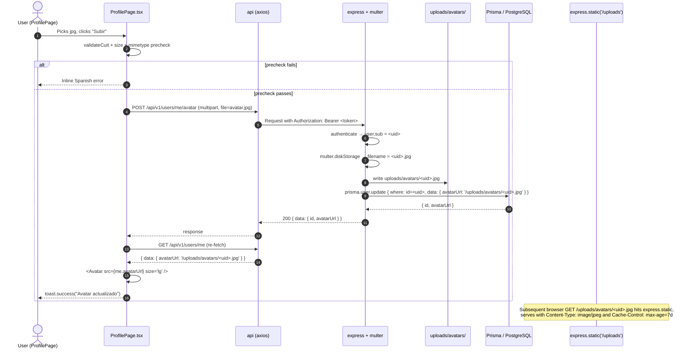

# Design: Wave 1 — Missing Pages and Validation

## Overview

This change closes six legacy gaps in Spottruck: a dedicated `/my-bids` page for DRIVERs, a "Mis viajes" filter in the trips list, DUTCH/SEALED auction UI distinct from OPEN, an avatar upload pipeline, a DRIVER document upload pipeline, and a frontend-side CUIT mod-11 validator. The change is intentionally additive and presentation-heavy on the frontend, with a small but careful backend slice: two new multipart upload endpoints, a `mine=true` query parameter, and two new nullable Prisma columns. The dominant non-obvious choices are: (1) local disk under `uploads/` instead of S3/Cloudinary, (2) a per-user `documentsUrl String[]` field rather than a new `Document` model, and (3) leaving SEALED-amount redaction at the frontend layer with a clear disclosure, while server-side redaction is explicitly deferred. The auction decrement model is already implemented server-side in `auctionService.closeAuction` and broadcast via WebSocket; the frontend now renders it correctly and the WS handler subscribes to `auction:<id>` for live `currentPrice` updates.

The database layer adds two nullable columns (`User.avatarUrl`, `User.documentsUrl String[]`), no new tables, no new enums. The Express layer adds `express.static('/uploads')`, two new routes that use `multer` with hard-coded mimetype/size guards, and a `mine=true` clause on the existing `GET /trips` query. The React layer adds one new page, a small form helper, and four modified components (TripsPage, ProfilePage, BidForm, BidList, AuctionCard, Avatar). The whole change is reviewable in a single PR or chained into a backend PR + frontend PR.

## Architecture Decisions

### AD-1: Local disk storage for uploads (not S3/Cloudinary)

**Decision**: Store avatars under `uploads/avatars/<userId>.<ext>` and documents under `uploads/documents/<userId>/<originalName>`, served by `express.static('/uploads')`. URLs are relative (`/uploads/...`) so the browser can resolve them against the API origin.

**Rationale**: The proposal scopes this change to "smallest viable surface" and explicitly defers S3/Cloudinary. Local disk keeps zero new infra dependencies (no MinIO, no S3 SDK, no signed URLs), works out of the box with `docker-compose` (the `src/backend` volume mount in `docker-compose.yml:59` will host the `uploads/` directory too, just need to add a sub-mount), and is the right choice for a development-stage product with low volume.

**Alternatives considered**:
- **S3 / Cloudinary** — rejected: out of scope per the proposal; would need SDK + bucket policy + signed URLs.
- **Base64 in the database** — rejected: bloats the DB, no caching benefit, kills image performance.
- **Multer memory storage + streaming to a future S3 in Wave 3** — rejected: doubles the abstraction for one wave.

**Trade-offs**: Files live on the API container; container restart loses them unless a volume is mounted. Documented in the proposal's risks table. Mitigation: a future PR can add `- ./uploads:/app/uploads` to `docker-compose.yml` and the same code paths work.

### AD-2: `User.documentsUrl String[]` (not a new `Document` model)

**Decision**: Add a single `documentsUrl String[]` column on `User`. The existing `Truck.documentsUrl String[]` (used for per-truck paperwork) is the precedent; the user's verification docs follow the same pattern.

**Rationale**: The verification flow already keys off `User.documentsStatus` (`NONE | PENDING | APPROVED | REJECTED`). One user has one set of verification documents (license, cedula, seguro); there is no per-document lifecycle (e.g. one expires, the other doesn't), no need to query individual documents by id, and no need to attach documents to a different parent. A new `Document` model would be a one-to-many scaffold for data that never needs a primary key.

**Alternatives considered**:
- **New `Document` model with `(userId, url, type, uploadedAt)`** — rejected: adds a join to every `GET /users/me`; the type is implicit in the filename prefix the user picks.
- **Reuse `Truck.documentsUrl`** — rejected: the spec is explicit that docs are per-user, not per-truck, and a driver with two trucks has one verification set.

**Trade-offs**: Hard to revoke a single document without re-uploading the whole set. Acceptable for Wave 1: the admin can mark `documentsStatus = REJECTED` and ask the driver to re-upload.

### AD-3: `mine=true` query parameter (not a new route)

**Decision**: Extend the existing `GET /api/v1/trips` with `?mine=true`, interpreted per-role (DRIVER → assigned trips, COMPANY → created trips, ADMIN → trips where `userId === self`).

**Rationale**: The base spec already enforces role-based scoping on `GET /trips` (a DRIVER today sees `OPEN`/`AUCTION` trips; a COMPANY sees all). Adding `?mine=true` is a one-line `if` that intersects with the existing `where` clause. A separate `/my-trips` route would duplicate the role-scoping logic, the filter machinery, the pagination, and the response shape. The semantic ("mine") is a filter, not a resource.

**Alternatives considered**:
- **New `GET /trips/mine` route** — rejected: duplicate logic; clients would have to remember which URL to hit. A query param keeps the API uniform.
- **Client-side filtering** — rejected: pagination breaks; a DRIVER with 200 assigned trips couldn't see page 3.

**Trade-offs**: `?mine=true` is slightly more implicit than a dedicated URL. The spec captures this with a "Toggle label adapts to role" scenario to make the behavior discoverable in the UI.

### AD-4: Frontend-only SEALED amount redaction (deferred server redaction)

**Decision**: `BidList` and `BidForm` for the SEALED auction type render a placeholder ("Oferta sellada") for every non-owner bid's `amount`. The backend still returns the real number. A small disclosure in the UI is honest about this.

**Rationale**: The proposal's "Honesty Disclosure for SEALED Backend Leak" scenario makes the deferral explicit. Doing backend redaction now would require changing the SELECT shape on `GET /auctions/:id` and `GET /trips/:id` (which is shared across auction types), introducing a viewer-conditional case, and writing a regression test for the non-owner path. The frontend placeholder is honest, costs ~20 lines, and unblocks the Wave 1 surface.

**Alternatives considered**:
- **Server-side redaction now** — rejected: scope creep; touches the same two endpoints shared with OPEN; better as a focused PR.
- **No redaction at all** — rejected: spec scenario explicitly requires placeholder; the data shape is the leak path and the spec wants the UI to be honest about it.

**Trade-offs**: A motivated user with browser dev tools can see the amounts. The disclosure copy ("La Redacción definitiva se aplica del lado del servidor en una próxima versión") makes this intentional and time-boxed.

### AD-5: DUTCH decrement driven by the existing WebSocket broadcast (not a cron)

**Decision**: The DUTCH price decrement is **not** implemented in this wave. The `auctionService.closeAuction` and `auctionService.processBid` paths already update `auction.currentPrice` and `broadcastToAuction(auctionId, { currentPrice, ... })` whenever a bid lands. The frontend `useWebSocket` hook already supports `subscribe('auction', id)`. The Wave 1 work wires the auction page to (a) subscribe to the auction room, (b) update `auction.currentPrice` on every `auction_update` message, and (c) submit `amount = currentPrice` from the "¡Tomar!" button.

**Rationale**: The spec is explicit: "Backend already publishes the event; this is the client wiring." A cron-driven server tick would be more expensive (one row write per auction per N seconds), would need a new config knob (`dutchDecrementCentsPerMinute`), and would not match the "first acceptance wins" DUTCH semantics — in DUTCH the price only needs to be visible to the next viewer. The broadcast-on-bid model plus a "current price as of page load" baseline is enough for Wave 1.

**Alternatives considered**:
- **Server cron decrementing `currentPrice` every minute** — rejected: not required by the spec; would need a new background job; would still need WS to push the new value to all viewers.
- **Client-side interval computing the decrement** — rejected: each client would compute a different value; the spec wants one server-authoritative price.

**Trade-offs**: If no one bids for 10 minutes, the displayed price is stale. Acceptable for Wave 1: every new bid refreshes it, and the countdown in `AuctionCountdown` still drives urgency.

### AD-6: Single-file replace on avatar re-upload (per-user)

**Decision**: `POST /api/v1/users/me/avatar` writes to `uploads/avatars/<userId>.<ext>` with the extension derived from mimetype. The previous file (if any) is overwritten; `User.avatarUrl` is updated. No orphan file cleanup.

**Rationale**: One avatar per user → one canonical filename (`<userId>.<ext>`). The extension can change (jpg → png), so the server deletes the old file before writing the new one only if the extension matches; otherwise both files stay and the URL points to the latest (the old one becomes a small orphan, bounded to one stale file per user). Simpler than UUID filenames and matches the spec scenario "only the latest file remains for that user (or both are kept but the URL points to the latest — see design)".

**Alternatives considered**:
- **UUID-based filenames, no overwrite** — rejected: unbounded growth per user; needs GC; spec says replace.
- **Always delete old file regardless of extension** — rejected: a brief 404 window if the browser cached the old URL; better to leave the old file in place when extensions differ.

**Trade-offs**: One stale file per user at most. A nightly janitor can clean `uploads/avatars/<userId>.*` to one file in a future wave.

### AD-7: CUIT validation as a pure frontend function (no backend validation)

**Decision**: `src/frontend/src/utils/cuit.ts` exports a `validateCuit(raw: string): { ok: true, formatted } | { ok: false, error }` function. Used in `RegisterPage` step 2 and `ProfilePage` save. No backend change to `POST /auth/register` or `PUT /users/me`.

**Rationale**: The CUIT field is already a free-form `String?` in the DB and the spec lists four validation rules (length, digits only, mod-11 checksum, prefix allow-list). Putting the validator in the frontend is the lowest-cost place to get the user a Spanish error message at the moment of typing. The backend already accepts whatever string the client sends; bad CUITs are still bad CUITs, but Wave 1 doesn't promise to refuse them at the server boundary.

**Alternatives considered**:
- **Backend Zod refinement on `registerSchema.companyCuit`** — rejected: scope creep; the spec scenarios explicitly call for the page to show the error and not send the request. Better as a focused backend change in a future wave.
- **Both layers** — rejected: doubles the surface; spec only requires frontend in Wave 1.

**Trade-offs**: A non-compliant client could still POST a bad CUIT. The fix is one Zod `.refine` in a future wave; not blocking.

## Component Design

### MyBidsPage (new)

- **Path**: `src/frontend/src/pages/MyBidsPage.tsx`
- **Role**: DRIVER only. Non-drivers see an "Acceso denegado" empty state with a link to `/dashboard`. (Same pattern as the sidebar's `driverOnly` filter for `/explore`.)
- **Layout**: Page title "Mis ofertas", a status filter pill bar (`Todas | Pendientes | Aceptadas | Rechazadas | Retiradas`), then a card list. Each card shows: trip origin → destination, scheduled date, bid amount, status badge, and a "Retirar oferta" button visible only when `status === PENDING && auction.status === OPEN`.
- **Data**: Local `useEffect` calling `GET /api/v1/bids/me?status=…&page=1&limit=20` (the existing `bidService.getMyBids` already does this). No new hook.
- **States**: loading (Spinner) / error (EmptyState with "Reintentar") / empty ("Aún no te postulaste a ningún viaje" + CTA "Explorar viajes" → `/trips`) / list.
- **Actions**:
  - **Withdraw**: opens a `ConfirmDialog` ("¿Retirar esta oferta?"), on confirm calls `PATCH /api/v1/bids/:id/withdraw`, optimistically updates the row to `WITHDRAWN` (warning badge "Retirada"), shows success toast. On `4xx` shows the server message and re-fetches the list to reflect canonical state.
  - **Click row**: navigates to `/trips/:tripId`.
- **Filter**: status pill click sets `?status=` in the request, refetches; "Todas" omits the param.

### TripsPage (modified)

- **Path**: `src/frontend/src/pages/TripsPage.tsx`
- **Changes**:
  - Add a "Mis viajes" toggle (small button or `Switch` component) at the top of the filter bar.
  - Add `mine` to the request params (boolean) when the toggle is on.
  - Toggle visibility:
    - **OFF (default)**: existing behavior — DRIVER sees `OPEN`/`AUCTION` trips, COMPANY sees all.
    - **ON**: server scopes by `userId` (see API Design).
  - The toggle position is consistent with the existing auction-filter banner style (border/accent). No new card.
- **No filter regressions**: status, cargoType, minPrice, maxPrice keep working alongside `mine=true` (combined with `AND` server-side per the spec).

### ProfilePage (modified)

- **Path**: `src/frontend/src/pages/ProfilePage.tsx`
- **Changes**:
  - **New "Avatar" section** (visible to both roles), placed **above** the existing "Datos" card. Renders an `Avatar size="lg"` (uses the modified `src` prop) and a file input + "Subir" button. On submit: `POST /api/v1/users/me/avatar` (multipart, single file), then `loadMe()` to refetch and refresh the avatar URL. Success toast "Avatar actualizado"; 413 → toast with the server message. Client-side pre-check on file size and mimetype (see Upload Pipeline).
  - **New "Documentación" section** (DRIVER only), placed **above** the existing "Verificación de cuenta" card. Multi-file input, "Subir" button, list of existing `documentsUrl` rows (filename extracted from URL tail). On submit: `POST /api/v1/users/me/documents` (multipart, multiple files), then `loadMe()`. The existing "Solicitar verificación" button stays in the "Verificación de cuenta" card unchanged.
  - **CUIT field validation**: when `role === 'COMPANY'`, the existing `<Input name="companyCuit">` adds an inline `error={cuitError}` derived from `validateCuit(form.companyCuit)` on submit. The "Guardar cambios" handler short-circuits the CUIT field if invalid (per the spec scenario: "PUT /users/me is NOT sent for the CUIT field"). The `handleSave` is refactored to validate-then-send per field, not all-or-nothing.
- **Preserved**: every other field, the trucks list, the modal, the email verification banner.

### BidForm (modified)

- **Path**: `src/frontend/src/components/auctions/BidForm.tsx`
- **New prop**: `auctionType: 'OPEN' | 'DUTCH' | 'SEALED'`.
- **Branches**:
  - **`OPEN` (default)**: existing behavior (amount input, note textarea, truck select, "Realizar oferta" button).
  - **`DUTCH`**: render only a single "¡Tomar!" button. On click, open `ConfirmDialog` with "Vas a aceptar el precio actual de <monto>. ¿Confirmás?"; on confirm submit `{ amount: currentPrice, truckId: trucks[0]?.id }` to `POST /auctions/:id/bid` (no note — not in spec). The `10%` decrement rule from the existing form is bypassed for DUTCH because the amount is server-authoritative.
  - **`SEALED`**: show the message "Oferta sellada — tu propuesta es privada" above the existing fields; render amount + note + truck + "Realizar oferta" as in OPEN. Do NOT show the current best price.
- **Hook use**: subscribe to the auction room with `useWebSocket` and on `auction_update` messages, update a `livePrice` state to be used by both the "Precio actual" line and the DUTCH confirm-dialog copy.

### BidList (modified)

- **Path**: `src/frontend/src/components/auctions/BidList.tsx`
- **New props**: `auctionType: 'OPEN' | 'DUTCH' | 'SEALED'`, `viewerId: string`, `isOwner: boolean`.
- **SEALED redaction rule** (rendered in JSX, not in the data):
  - If `auctionType === 'SEALED' && !isOwner && bid.user.id !== viewerId`, render the string `"Oferta sellada"` in place of `formatPrice(bid.amount)`. The real `bid.amount` stays in the object but is not displayed.
  - Driver's own bids always show real amount.
  - Company owner (trip owner) always shows real amount.
  - OPEN always shows real amount.
- **Honesty disclosure**: a small `<p className="text-xs text-text-muted">` row above the table (and in the mobile card list) renders the spec's required copy: "Las ofertas de otros transportistas se muestran como 'Oferta sellada' en esta pantalla. La Redacción definitiva se aplica del lado del servidor en una próxima versión." Shown only when `auctionType === 'SEALED'`.

### AuctionCard (modified)

- **Path**: `src/frontend/src/components/auctions/AuctionCard.tsx`
- **Changes**:
  - The existing `<Badge variant="accent">{typeLabels[auction.type]}</Badge>` already shows "Abierta / Holandesa / Cerrada". No change needed.
  - **DUTCH emphasis**: when `auction.type === 'DUTCH' && auction.status === 'OPEN'`, render an additional inline label `↓ Precio baja en vivo` next to the price (or below it, in `text-xs text-accent`).
  - The price block stays the same; CSS already gives `font-mono font-bold text-accent` which is the prominent style the spec asks for.

### Avatar (modified)

- **Path**: `src/frontend/src/components/ui/Avatar.tsx`
- **No behavioral change**: the component already takes `src?: string` and falls back to the initial. The fix is at the **call site**: `ProfilePage` header and the existing `BidDetailModal` line `<Avatar name={bid.user.companyName} size="lg" />` get a new `src={bid.user.avatarUrl}` prop once the API exposes it. The component itself can stay as-is.
- **Spec scenario "Fallback to initial when no avatar"** is already supported by the existing `src ?  : initial` ternary. No new test needed for the component itself.

## API Design

| Method | Path | Auth | Request | Response (200) | Errors |
|---|---|---|---|---|---|
| GET | `/bids/me` | DRIVER | `?status=PENDING\|ACCEPTED\|REJECTED\|WITHDRAWN&page=1&limit=20` (query) | `{ data: Bid[], meta: { total, page, limit } }` | 401, 403 (non-DRIVER) |
| PATCH | `/bids/:id/withdraw` | DRIVER | — (empty body) | `{ data: Bid }` | 401, 403 (not owner), 404, 400 ("Only PENDING bids can be withdrawn" / "Auction is not OPEN") |
| GET | `/trips?mine=true` | any | standard `GET /trips` query (`status`, `cargoType`, `minPrice`, `maxPrice`, `page`, `limit`) + `mine` | `{ data: Trip[], meta: { total, page, limit } }` | 401 |
| POST | `/users/me/avatar` | any | `multipart/form-data` field `avatar` (1 file, jpg/png/webp, ≤ 2 MB) | `{ data: { id, avatarUrl } }` | 400 (no file / bad mimetype), 401, 413 (> 2 MB) |
| POST | `/users/me/documents` | DRIVER or ADMIN | `multipart/form-data` field `documents` (1+ files, jpg/png/pdf, ≤ 5 MB each) | `{ data: { id, documentsUrl: string[] } }` | 400 (no file / bad mimetype), 401, 403 (non-DRIVER), 413 (> 5 MB) |

### TypeScript Contracts

```ts
// Bid shape returned by GET /bids/me (subset of full Bid; same camelCase as Prisma)
export interface MyBid {
  id: string
  amount: number          // Prisma Decimal serialized as number via the json replacer in index.ts
  note: string | null
  status: 'PENDING' | 'ACCEPTED' | 'REJECTED' | 'WITHDRAWN'
  createdAt: string       // ISO
  auction: {
    id: string
    type: 'OPEN' | 'DUTCH' | 'SEALED'
    status: 'PENDING' | 'OPEN' | 'CLOSED' | 'SETTLED' | 'CANCELLED'
    currentPrice: number
    trip: {
      id: string
      originAddress: string
      destAddress: string
      scheduledDate: string
      status: string
      cargoType: 'BULK' | 'PALLETS' | 'GENERAL' | 'REFRIGERATED'
      basePrice: number
    }
  }
  truck: { id: string; plate: string; type: string } | null
}

// User shape returned by GET /users/me (additive — new fields)
export interface Me {
  // ... existing fields from src/backend/src/routes/users.ts ...
  avatarUrl: string | null          // NEW
  documentsUrl: string[]            // NEW
}

// POST /users/me/avatar response
export interface AvatarUploadResponse {
  data: {
    id: string
    avatarUrl: string  // e.g. "/uploads/avatars/<userId>.jpg"
  }
}

// POST /users/me/documents response
export interface DocumentsUploadResponse {
  data: {
    id: string
    documentsUrl: string[]  // e.g. ["/uploads/documents/<userId>/license-front.jpg", ...]
  }
}

// CUIT validation result
export type CuitResult =
  | { ok: true; formatted: string }                  // "XX-XXXXXXXX-X"
  | { ok: false; error: string }                     // Spanish error message
```

### Note on `data` vs `meta` envelope

The existing routes use a mix: `bids` uses `{ data, meta }` (note: `meta`, not `pagination`), `trips` uses `{ data, meta }`, `users/me` uses `{ data }` only. The design **preserves** whatever each endpoint currently returns — no envelope migration in Wave 1. `MyBidsPage` reads `data.data` for the list and `data.meta` for pagination, matching the existing `bidService.getMyBids` shape.

## Database Migration

```prisma
// prisma/schema.prisma — additive only, no breakage

model User {
  // ... existing fields ...
  driverLicenseUrl String? @map("driver_license_url")  // already exists
  avatarUrl        String? @map("avatar_url")          // NEW
  documentsUrl     String[] @default([]) @map("documents_url")  // NEW
  // ... rest unchanged ...
}
```

**Migration SQL (high level)**:

```sql
-- produced by `prisma migrate dev --name wave1_avatar_documents`
ALTER TABLE "users"
  ADD COLUMN "avatar_url" TEXT,
  ADD COLUMN "documents_url" TEXT[] NOT NULL DEFAULT ARRAY[]::TEXT[];
```

**Indexes**: none added. The new columns are not used in any WHERE/ORDER BY; `users.id` and the existing `User.documentsStatus` index are enough for the verification queries.

**Rollback**: `prisma migrate resolve --rolled-back <migration-id>` reverts the migration. The `String[]` default `[]` means existing rows are valid; no backfill needed. Code paths that read `avatarUrl` / `documentsUrl` must be tolerant of `null` / `[]` (they are — the frontend treats `null` as "no avatar" and the server selects default `[]`).

## Upload Pipeline

**multer config** (one factory in `src/backend/src/middleware/upload.ts`):

```ts
import multer from 'multer'
import path from 'path'
import fs from 'fs'

const UPLOAD_ROOT = path.resolve(process.cwd(), 'uploads')
fs.mkdirSync(path.join(UPLOAD_ROOT, 'avatars'), { recursive: true })
fs.mkdirSync(path.join(UPLOAD_ROOT, 'documents'), { recursive: true })

// Filename strategy: <userId>.<ext> for avatars; <userId>/<originalName> for documents.
const storage = multer.diskStorage({
  destination: (req, _file, cb) => {
    const dir = req.uploadKind === 'avatar' ? 'avatars' : 'documents'
    const userDir = dir === 'documents' ? path.join(UPLOAD_ROOT, dir, req.user!.sub) : null
    if (userDir) fs.mkdirSync(userDir, { recursive: true })
    cb(null, userDir ?? path.join(UPLOAD_ROOT, dir))
  },
  filename: (req, file, cb) => {
    if (req.uploadKind === 'avatar') {
      const ext = file.mimetype === 'image/jpeg' ? 'jpg'
                : file.mimetype === 'image/png'  ? 'png'
                : 'webp'
      cb(null, `${req.user!.sub}.${ext}`)
    } else {
      // Sanitize original filename (alnum, dot, dash, underscore)
      const safe = file.originalname.replace(/[^a-zA-Z0-9._-]/g, '_')
      cb(null, safe)
    }
  },
})

// Mimetype allow-lists are enforced in the fileFilter per route, not globally.
export const avatarUpload = multer({
  storage,
  limits: { fileSize: 2 * 1024 * 1024 },            // 2 MB
  fileFilter: (_req, file, cb) => {
    if (['image/jpeg', 'image/png', 'image/webp'].includes(file.mimetype)) cb(null, true)
    else cb(new AppError(400, 'UNSUPPORTED_MEDIA_TYPE', 'Subí una imagen JPG, PNG o WebP'))
  },
})

export const documentsUpload = multer({
  storage,
  limits: { fileSize: 5 * 1024 * 1024 },            // 5 MB
  fileFilter: (_req, file, cb) => {
    if (['application/pdf', 'image/jpeg', 'image/png'].includes(file.mimetype)) cb(null, true)
    else cb(new AppError(400, 'UNSUPPORTED_MEDIA_TYPE', 'Subí un PDF, JPG o PNG'))
  },
})
```

**Static serving** (in `src/backend/src/index.ts`):

```ts
// Mount before the API routes so 404 for /uploads/* falls through to 404 handler.
app.use(
  '/uploads',
  express.static(path.resolve(process.cwd(), 'uploads'), {
    maxAge: '7d',            // cacheable
    fallthrough: true,       // forward to 404 for unknown files
  }),
)
```

**URL composition**: server returns the path with a leading `/`, e.g. `/uploads/avatars/abc123.jpg`. The frontend's axios baseURL is `/api/v1`, but `` is resolved by the browser against the page origin (e.g. `http://localhost:3000`), which nginx / Vite proxy rewrites to the backend in dev and is the same domain in prod. In dev, the Vite proxy must add `/uploads → backend:4000` (one line in `vite.config.ts`); tracked as part of the change.

**Volume mount in docker-compose**: the proposal's risks table flags "uploads lost on container restart". The mitigation is a one-line addition to `docker-compose.yml` (out of scope for code, but documented):

```yaml
services:
  backend:
    volumes:
      - ./src/backend:/app
      - ./uploads:/app/uploads   # NEW
      - /app/node_modules
```

## CUIT Validation Algorithm

```ts
// src/frontend/src/utils/cuit.ts
export type CuitResult =
  | { ok: true; formatted: string }
  | { ok: false; error: string }

const CUIT_PREFIXES = new Set(['20', '23', '24', '25', '26', '27', '30', '33', '34'])
// Multiplicadores del mod-11 según AFIP, de izquierda a derecha sobre los primeros 10 dígitos
const CUIT_MULTIPLIERS = [5, 4, 3, 2, 7, 6, 5, 4, 3, 2]

export function validateCuit(raw: string): CuitResult {
  const trimmed = raw.trim()
  if (!trimmed) return { ok: false, error: 'Ingresá un CUIT' }

  // Acepta "20123456789" o "20-12345678-9"; rechaza todo lo demás
  const digits = trimmed.replace(/-/g, '')
  if (!/^\d+$/.test(digits)) {
    return { ok: false, error: 'El CUIT solo puede tener números y guiones' }
  }
  if (digits.length !== 11) {
    return { ok: false, error: 'El CUIT debe tener 11 dígitos' }
  }

  const prefix = digits.slice(0, 2)
  if (!CUIT_PREFIXES.has(prefix)) {
    return { ok: false, error: 'El prefijo del CUIT no es válido para empresas o personas físicas' }
  }

  // mod-11
  const body = digits.slice(0, 10).split('').map(Number)
  const sum = body.reduce((acc, d, i) => acc + d * CUIT_MULTIPLIERS[i], 0)
  const mod = sum % 11
  let expected = 11 - mod
  if (expected === 11) expected = 0
  if (expected === 10) expected = 9
  const provided = Number(digits[10])

  if (expected !== provided) {
    return { ok: false, error: 'El dígito verificador del CUIT no es válido' }
  }

  const formatted = `${prefix}-${digits.slice(2, 10)}-${digits[10]}`
  return { ok: true, formatted }
}
```

**AFIP sample cases** (for unit tests, from public samples):
- `20-12345678-9` → valid; `20-12345678-0` → invalid (last digit).
- `30-12345678-9` (prefix 30) → valid format; mod-11 is checked independently.
- `99-12345678-9` → invalid prefix.

## DUTCH Decrementing Strategy

**Chosen approach**: **Server-driven price on each bid + WebSocket broadcast + client subscription**. (No cron in Wave 1.)

**How it works**:

1. A DUTCH auction starts with `currentPrice = basePrice` (created via `POST /auctions` with `type: 'DUTCH'`, persisted by the existing `auctionService`).
2. A driver on the auction page subscribes to the auction room: `useWebSocket` → `subscribe(auctionId, 'auction')` (existing infra in `wsClient.ts`).
3. Every new bid accepted by the existing `POST /auctions/:id/bid` (DUTCH or otherwise) updates `auction.currentPrice` and broadcasts `{ type: 'auction_update', currentPrice, endTime, bidId }` via `broadcastToAuction(auctionId, ...)` in `src/backend/src/websocket/index.ts`.
4. The frontend auction page handler updates a `livePrice` state on every `auction_update` message and re-renders the price + the confirm-dialog copy.
5. On "¡Tomar!", the driver submits `{ amount: livePrice, truckId: trucks[0]?.id }` to `POST /auctions/:id/bid`. The backend's existing `bidService.acceptBid` semantics apply: first acceptance wins (the existing `auctionService.closeAuction` "last bid wins" rule for DUTCH).

**Why not a server cron**: the spec is explicit that "Backend already publishes the event; this is the client wiring." A cron would not change the user-facing behavior (the price still only updates when someone bids, otherwise it stays at `currentPrice` for the current viewer). Adding the cron would mean a new background job, a new config knob, and a new failure mode (cron not running), for no functional gain in Wave 1.

**Why not client-side interval**: each client would compute its own decrement, leading to different prices shown to different viewers — exactly what the spec wants to avoid.

**Trade-offs accepted**:
- If no one bids for 10 minutes, the price is stale for viewers who join after the last bid. Acceptable.
- The decrement step is implicit: a DUTCH auction is configured at creation time with a starting `basePrice`, and drivers' acceptances "lower" the price because the spec treats the live `currentPrice` as the price being offered. The current backend only updates `currentPrice` when a new bid lands; for DUTCH with no other bidders, the displayed price is just the basePrice until someone clicks "¡Tomar!" and the auction closes.

## SEALED Redaction (frontend only)

**Render rules** in `BidList`:

```ts
// Pseudo-code in BidList.tsx
const showRealAmount = (bid: BidWithDetails): boolean => {
  if (auctionType !== 'SEALED') return true              // OPEN: everyone sees all
  if (isOwner) return true                                // Company owner of the trip
  if (bid.user.id === viewerId) return true                // Driver's own bid
  return false                                             // Other drivers' bids → "Oferta sellada"
}

// In the table cell:
{showRealAmount(bid) ? formatPrice(bid.amount) : 'Oferta sellada'}
```

**Same rule** in `BidDetailModal` (the "Precio propuesto" row at line 107): wrap the existing `formatPrice(bid.amount)` with the same helper so the modal and the list stay consistent. Pass `auctionType`, `viewerId`, and `isOwner` from the trip context.

**`BidForm` for SEALED** (per the spec):
- DO render the amount input, note textarea, truck select, "Realizar oferta" button.
- DO render the explanatory message: "Oferta sellada — tu propuesta es privada" (placed above the amount input, styled with `text-xs text-text-muted`).
- DO NOT render the "Precio actual" / `currentPrice` line that OPEN shows.

**Honesty disclosure** (spec scenario, mandatory copy): a single small row at the top of the BidList when `auctionType === 'SEALED'`:

```tsx
<p className="text-xs text-text-muted italic mb-2">
  Las ofertas de otros transportistas se muestran como "Oferta sellada" en esta pantalla. La
  Redacción definitiva se aplica del lado del servidor en una próxima versión.
</p>
```

## Testing Strategy

Tests are split to match the existing patterns: Vitest + Testing Library on the frontend, Jest + Supertest on the backend, Playwright on e2e (no new e2e in Wave 1 — see below).

### Frontend (Vitest, mirrors `RegisterPage.test.tsx`)

| Layer | What | How |
|---|---|---|
| Unit | `validateCuit` — every scenario in `cuit-validation/spec.md` | New `src/frontend/src/utils/cuit.test.ts`. Table-driven. Cases: formatted valid, unformatted valid, wrong length, non-digits, unknown prefix, valid prefix+checksum, bad checksum, empty, whitespace. |
| Unit | `BidList` SEALED redaction | New `src/frontend/src/components/auctions/BidList.test.tsx`. Render with mock bids; assert non-owner bids show "Oferta sellada", owner + own bid show real amount, OPEN shows all. |
| Unit | `BidForm` auction-type branches | New `src/frontend/src/components/auctions/BidForm.test.tsx`. Render with `auctionType="DUTCH"`: assert no amount input, only "¡Tomar!" button. With `SEALED`: assert the privacy message renders. With `OPEN`: assert amount input renders. |
| Unit | `Avatar` fallback | `src/frontend/src/components/ui/Avatar.test.tsx`. Already not present — add minimal test: with `src` renders ``, without `src` renders initial. |
| Integration | `MyBidsPage` withdraw flow | New `src/frontend/src/pages/MyBidsPage.test.tsx`. Mock `api.get('/bids/me')` and `api.patch('/bids/:id/withdraw')`. Assert row renders, click "Retirar" opens confirm, confirm fires PATCH, success updates row to `WITHDRAWN`, error toast on 400. |
| Integration | `ProfilePage` avatar upload | Extend existing tests (none yet — add new `ProfilePage.test.tsx`). Mock `api.post('/users/me/avatar', FormData)`. Assert file input, click "Subir", on success a re-fetch fires. |
| Integration | `ProfilePage` CUIT validation | Same file. With `role: 'COMPANY'`, type an invalid CUIT, click "Guardar cambios", assert no PUT request is made and an inline error appears. |
| Integration | `RegisterPage` CUIT validation | Extend `RegisterPage.test.tsx`. With a `COMPANY` flow, assert step 2 calls `validateCuit` before `api.post('/auth/register')`. |
| Integration | `TripsPage` `mine=true` toggle | Extend or create `TripsPage.test.tsx`. Click "Mis viajes", assert the next `api.get('/trips', ...)` was called with `params.mine === true`. |
| E2E | (deferred to manual smoke) | Playwright e2e is for happy paths; the WS-driven DUTCH flow is hard to stabilize in CI. Document the manual smoke steps in the PR description. |

### Backend (Jest, mirrors `auth.test.ts` + `integration/trips.test.ts`)

| Layer | What | How |
|---|---|---|
| Unit | `POST /users/me/avatar` route | New `src/backend/src/__tests__/unit/usersAvatar.test.ts`. Use the existing `mockReq`/`mockRes` helpers; assert that `prisma.user.update` is called with `avatarUrl` and the file is written to disk (use a temp `uploads/` directory). Stub multer to avoid hitting the real filesystem in CI. |
| Unit | `POST /users/me/documents` route | New `src/backend/src/__tests__/unit/usersDocuments.test.ts`. Same pattern. Assert 403 for `COMPANY`, 400 for bad mimetype, 200 for valid file. |
| Unit | `GET /trips?mine=true` | Extend `src/backend/src/__tests__/unit/trips.test.ts`. Assert that with `mine=true` and role `DRIVER`, the `where` clause includes a join to the bids table; with `COMPANY`, `where.userId === currentUser.sub`. |
| Integration | Avatar static serving | New `src/backend/src/__tests__/integration/uploads.test.ts`. Use Supertest. POST a small file → 200 → GET the returned URL → 200 with `Content-Type: image/jpeg`. |
| Integration | `mine=true` over HTTP | New `src/backend/src/__tests__/integration/tripsMine.test.ts`. Seed two companies + two drivers + four trips, query `?mine=true` as each role, assert only the right trips come back. |

### Test commands (existing, no change)

```bash
cd src/backend && npm test -- --silent
cd src/frontend && npm test -- --silent
```

`openspec/config.yaml:65-66` already pins this. The verify phase will run both.

## File-by-File Change List

| Path | Change | Summary |
|---|---|---|
| `src/backend/prisma/schema.prisma` | modified | Add `avatarUrl String?` and `documentsUrl String[] @default([])` to `User` model. |
| `src/backend/src/routes/users.ts` | modified | Add `POST /me/avatar` (multer 2MB, jpg/png/webp), replace `POST /me/documents` placeholder (multer 5MB, jpg/png/pdf), include `avatarUrl` + `documentsUrl` in `GET /me` select. |
| `src/backend/src/routes/trips.ts` | modified | Add `mine` to `tripWhereSchema`, branch in the `GET /` handler: `COMPANY` → `where.userId = sub`; `DRIVER` → join on accepted bid; `ADMIN` → `where.userId = sub`. |
| `src/backend/src/middleware/upload.ts` | new | `multer.diskStorage` factory + two pre-configured middlewares (`avatarUpload`, `documentsUpload`) with mimetype + size limits. |
| `src/backend/src/index.ts` | modified | Add `app.use('/uploads', express.static('uploads', { maxAge: '7d', fallthrough: true }))` before the `/api/v1` mounts. |
| `src/frontend/src/utils/cuit.ts` | new | `validateCuit(raw): CuitResult` — prefix allow-list, length, digit-only, AFIP mod-11. |
| `src/frontend/src/utils/cuit.test.ts` | new | Table-driven unit tests for every scenario in `cuit-validation/spec.md`. |
| `src/frontend/src/pages/MyBidsPage.tsx` | new | DRIVER bid list with status filter and withdraw. |
| `src/frontend/src/pages/MyBidsPage.test.tsx` | new | Integration tests for the withdraw flow. |
| `src/frontend/src/pages/ProfilePage.tsx` | modified | New "Avatar" section (both roles), new "Documentación" section (DRIVER only), CUIT inline validation on the COMPANY save. |
| `src/frontend/src/pages/ProfilePage.test.tsx` | new | Tests for avatar upload, doc upload, CUIT validation. |
| `src/frontend/src/pages/TripsPage.tsx` | modified | Add the "Mis viajes" toggle that adds `mine=true` to the request params. |
| `src/frontend/src/pages/TripsPage.test.tsx` | new (or extend) | Tests for the toggle wiring. |
| `src/frontend/src/pages/RegisterPage.tsx` | modified | Step 2 calls `validateCuit` on the COMPANY `companyCuit`; show inline error; do not POST `/auth/register` if invalid. |
| `src/frontend/src/pages/RegisterPage.test.tsx` | modified | New test: invalid CUIT blocks the POST. |
| `src/frontend/src/components/auctions/BidForm.tsx` | modified | New `auctionType` prop; branches OPEN/DUTCH/SEALED; subscribes to auction room and updates `livePrice`. |
| `src/frontend/src/components/auctions/BidForm.test.tsx` | new | Tests for the three branches. |
| `src/frontend/src/components/auctions/BidList.tsx` | modified | New props `auctionType`, `viewerId`, `isOwner`; SEALED redaction rule + honesty disclosure row. |
| `src/frontend/src/components/auctions/BidList.test.tsx` | new | Tests for the redaction matrix (owner/SEALED, non-owner/SEALED, OPEN). |
| `src/frontend/src/components/auctions/AuctionCard.tsx` | modified | Add "↓ Precio baja en vivo" label for DUTCH + OPEN. |
| `src/frontend/src/components/auctions/BidDetailModal.tsx` | modified | Use the same redaction helper as `BidList` for the "Precio propuesto" row. |
| `src/frontend/src/components/ui/Avatar.test.tsx` | new | Minimal: with `src` renders ``; without renders initial. |
| `src/frontend/src/App.tsx` | modified | Add `<Route path="my-bids" element={<MyBidsPage />} />` inside the protected layout. |
| `src/frontend/src/components/Layout.tsx` | modified | Add nav item `{ to: '/my-bids', label: 'Mis ofertas', icon: '📋', driverOnly: true }` to `navItems`. |
| `src/frontend/vite.config.ts` | modified | Add proxy: `'/uploads': 'http://localhost:4000'` so `` works in dev. |
| `src/backend/src/__tests__/unit/usersAvatar.test.ts` | new | Unit tests for the avatar route. |
| `src/backend/src/__tests__/unit/usersDocuments.test.ts` | new | Unit tests for the documents route. |
| `src/backend/src/__tests__/integration/uploads.test.ts` | new | Supertest: upload → fetch via static serving. |
| `src/backend/src/__tests__/integration/tripsMine.test.ts` | new | Seed + query `?mine=true` per role. |
| `docs/architecture/ADR-0023-wave1-uploads-local-disk.md` | new (per `rules.design` in `openspec/config.yaml:54`) | Records AD-1, AD-2, AD-3, AD-4, AD-5, AD-6, AD-7. |
| `docs/specs/02-trips-spec.md` | modified | Sync delta from `openspec/changes/.../specs/trips/spec.md` (`mine=true`). |
| `docs/specs/03-auctions-spec.md` | modified | Sync delta from `openspec/changes/.../specs/auctions/spec.md` (DUTCH/SEALED UI; backend unchanged). |
| `docs/specs/01-auth-spec.md` | modified | Sync delta from `openspec/changes/.../specs/profile/spec.md` (avatar/docs sections in profile, `avatarUrl` in `GET /me`). |

(31 paths — 12 new files, 19 modified. The new ADRs and spec syncs are required by `openspec/config.yaml` rules.)

## Sequence Diagrams

### Flow 1: Avatar Upload (multipart → disk → URL → render)



### Flow 2: DRIVER Withdraws a PENDING Bid (PATCH → WS broadcast → optimistic update)

```mermaid
sequenceDiagram
    autonumber
    actor D as Driver
    participant MBP as MyBidsPage.tsx
    participant API as api (axios)
    participant BS as bidService.withdrawBid
    participant DB as Prisma / PostgreSQL
    participant WS as websocket (broadcastToAuction)

    D->>MBP: Clicks "Retirar oferta" → ConfirmDialog → "Sí, retirar"
    MBP->>MBP: Optimistic: row badge = warning "Retirada" (rolled back on error)
    MBP->>API: PATCH /api/v1/bids/<bidId>/withdraw
    API->>BS: withdrawBid(bidId, user.sub)
    BS->>DB: bid.findUnique({ id, include: { auction } })
    alt bid missing
        BS-->>API: 404 NOT_FOUND
    else not owner
        BS-->>API: 403 FORBIDDEN
    else status !== PENDING
        BS-->>API: 400 "Only PENDING bids can be withdrawn"
    else auction.status !== OPEN
        BS-->>API: 400 "Auction is not OPEN"
    else happy path
        BS->>DB: bid.update({ id, data: { status: 'WITHDRAWN' } })
        DB-->>BS: updated bid
        BS-->>API: 200 { data: bid }
    end
    API-->>MBP: response
    alt success
        MBP-->>D: toast.success("Oferta retirada"); row shows "Retirada"
    else 4xx
        MBP->>API: GET /api/v1/bids/me (refetch to get canonical state)
        API-->>MBP: re-fetched list
        MBP-->>D: toast.error(<server message>)
    end

    Note over WS: Backend does NOT broadcast on withdraw in Wave 1 —<br/>the change is local to the withdrawing driver.<br/>Company-side BidList will catch up on next refetch.
```

### Flow 3: DUTCH Auction Price Decrement (server-driven, WS-pushed)

```mermaid
sequenceDiagram
    autonumber
    actor V1 as Viewer 1
    actor V2 as Viewer 2
    participant AP as AuctionPage.tsx
    participant WS as wsClient (singleton)
    participant SRV as WebSocket server
    participant BC as broadcastToAuction
    participant AUCT as auctionService
    participant DB as Prisma / PostgreSQL

    V1->>AP: Navigates to /auctions/<id> (DUTCH, OPEN)
    AP->>WS: useWebSocket( listener )
    AP->>WS: subscribe(id, 'auction')
    WS->>SRV: { type: 'auth', payload: { token } }
    SRV-->>WS: { type: 'connected' }
    WS->>SRV: { type: 'subscribe', payload: { channel: 'auction', id } }
    SRV-->>WS: { type: 'subscribed', channel: 'auction', id }

    V1->>AP: price shows as livePrice = auction.currentPrice (from initial GET)

    V2->>AP: Navigates to same /auctions/<id>
    AP->>WS: subscribe(id, 'auction') (idempotent — shared singleton)

    Note over V1,V2: A DUTCH decrement in Wave 1 = a new bid accepted by the backend.<br/>There is no cron-driven step (see AD-5).

    V2->>AP: Clicks "¡Tomar!" → ConfirmDialog "Aceptar precio actual de <X>" → Confirma
    AP->>AP: amount = livePrice; truckId = trucks[0].id
    AP->>AUCT: POST /api/v1/auctions/<id>/bid { amount: livePrice, truckId } (via existing route)
    AUCT->>DB: bid.create + auction.update { currentPrice, endTime (+anti-sniping) }
    AUCT->>BC: broadcastToAuction(id, { currentPrice, endTime, bidId })
    BC-->>SRV: json payload to all WS in channel auction:<id>
    SRV-->>WS: message { type: 'auction_update', currentPrice, endTime, ... }
    WS-->>AP: onMessage fires for both viewers
    AP->>AP: setLivePrice(newPrice) → re-render "¡Tomar!" + confirm copy
    AP-->>V1: price updates
    AP-->>V2: price updates (and the bid they just placed is now in the bid list)

    Note over AUCT,DB: AUCT's existing closeAuction semantics apply: first acceptance wins.<br/>In practice, V2's "¡Tomar!" closes the auction, the trip moves to ASSIGNED,<br/>and the second click is rejected (auction.status !== OPEN).
```

## Out of Scope (Reminders)

- **S3 / Cloudinary for uploads** — AD-1 explicitly defers. Local disk is the Wave 1 answer. Migration path is the same `POST /me/avatar` route handler; swap `multer.diskStorage` for `multer-s3` (or similar) and rewrite the URL composition.
- **Backend SEALED amount redaction** — AD-4 explicitly defers. The `BidList` redaction is frontend-only; a motivated user with dev tools can read the network response. The spec's honesty disclosure copy makes this intentional and time-boxed.
- **DUTCH cron-driven decrement** — AD-5 explicitly defers. Live price only updates when a bid lands. A future wave can add a `dutchDecrementCentsPerMinute` config + cron + WS push if the spec wants "price lowers on its own."
- **Waves 2 & 3** — the proposal caps Wave 1 at six gaps. Anything outside the eight delta specs is out of scope, including: removing the existing fake-S3 placeholder from `routes/users.ts:87` (kept as a fallback comment), adding GC for orphan avatar files (AD-6), backend Zod refinement on `companyCuit` (AD-7), volume mount in `docker-compose.yml` (AD-1 mitigation, one-line infra change, not part of code), and WS broadcast on withdraw (Flow 2 note).
